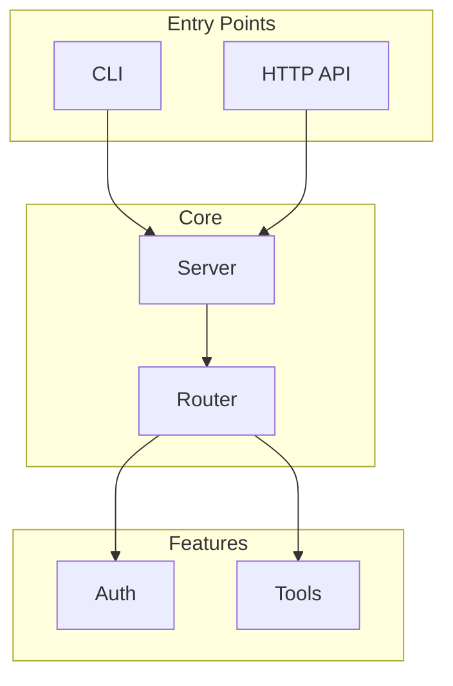
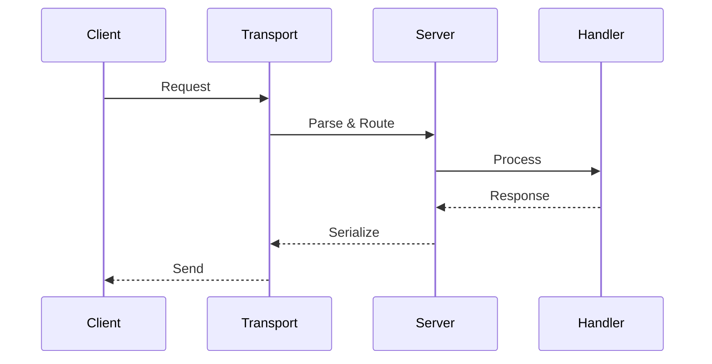

# Project Onboarding

Arguments: $ARGUMENTS

Analyze a codebase to understand its structure, build system, test infrastructure, and capabilities.

## Step 1: Determine Target and Load Instructions

**Arguments format**: `[directory] [instructions-file]`
- First argument: Project root directory (default: ".")
- Second argument: Optional path to instructions file with custom commands

**Example usages**:
```
/onboard                           # Current directory, no custom instructions
/onboard .                         # Current directory, no custom instructions
/onboard ./my-project              # Specific directory
/onboard . ./ONBOARD.md            # Current directory with instructions file
/onboard ./my-project ./setup.md   # Both directory and instructions
```

### Parse Arguments
```bash
# Split arguments - first is directory, second is instructions file
PROJECT_ROOT=$(echo "$ARGUMENTS" | awk '{print $1}')
INSTRUCTIONS_FILE=$(echo "$ARGUMENTS" | awk '{print $2}')

# Default to current directory if not specified
PROJECT_ROOT="${PROJECT_ROOT:-.}"
cd "$PROJECT_ROOT" 2>/dev/null || PROJECT_ROOT="."
pwd

# Check if instructions file exists
if [ -n "$INSTRUCTIONS_FILE" ] && [ -f "$INSTRUCTIONS_FILE" ]; then
  echo "FOUND: Instructions file at $INSTRUCTIONS_FILE"
fi
```

### Load Custom Instructions

If an instructions file is provided, read it to extract custom commands. The file should be markdown with code blocks for commands:

```markdown
# Example Instructions File

## Start Server
\`\`\`bash
npm run dev
\`\`\`

## Start UI
\`\`\`bash
cd packages/ui && VITE_AUTH_REQUIRED=false npm run dev
\`\`\`

## Run Tests
\`\`\`bash
OPENROUTER_API_KEY=xxx npm run test:e2e
\`\`\`

## Environment Variables
- OPENROUTER_API_KEY - required for E2E agent tests
- AUTH_ENABLED=false - bypass auth in dev mode

## Screenshots
- Start UI with: `cd packages/ui && npm run dev`
- Open: http://localhost:5173
```

**When instructions file is provided**:
1. Read the file content
2. Extract commands from code blocks under relevant headings
3. Use those commands instead of defaults in Steps 5, 6, and 7c
4. Include any noted environment variables in the report

## Step 2: Detect Project Type

Check for project markers to identify the ecosystem:

```bash
# Node/JavaScript/TypeScript
ls package.json 2>/dev/null && echo "DETECTED: Node.js"
ls tsconfig.json 2>/dev/null && echo "DETECTED: TypeScript"
ls bun.lockb 2>/dev/null && echo "DETECTED: Bun"
ls pnpm-lock.yaml 2>/dev/null && echo "DETECTED: pnpm"
ls yarn.lock 2>/dev/null && echo "DETECTED: Yarn"

# Python
ls pyproject.toml 2>/dev/null && echo "DETECTED: Python (modern)"
ls setup.py 2>/dev/null && echo "DETECTED: Python (setuptools)"
ls requirements.txt 2>/dev/null && echo "DETECTED: Python (pip)"
ls Pipfile 2>/dev/null && echo "DETECTED: Python (pipenv)"
ls poetry.lock 2>/dev/null && echo "DETECTED: Python (poetry)"

# Rust
ls Cargo.toml 2>/dev/null && echo "DETECTED: Rust"

# Go
ls go.mod 2>/dev/null && echo "DETECTED: Go"

# JVM
ls pom.xml 2>/dev/null && echo "DETECTED: Java (Maven)"
ls build.gradle 2>/dev/null && echo "DETECTED: Java/Kotlin (Gradle)"
ls build.gradle.kts 2>/dev/null && echo "DETECTED: Kotlin (Gradle KTS)"

# .NET
ls *.csproj 2>/dev/null && echo "DETECTED: .NET (C#)"
ls *.fsproj 2>/dev/null && echo "DETECTED: .NET (F#)"
ls *.sln 2>/dev/null && echo "DETECTED: .NET Solution"

# Ruby
ls Gemfile 2>/dev/null && echo "DETECTED: Ruby"
ls Rakefile 2>/dev/null && echo "DETECTED: Ruby (Rake)"

# C/C++
ls CMakeLists.txt 2>/dev/null && echo "DETECTED: C/C++ (CMake)"
ls Makefile 2>/dev/null && echo "DETECTED: C/C++ (Make)"
ls meson.build 2>/dev/null && echo "DETECTED: C/C++ (Meson)"

# PHP
ls composer.json 2>/dev/null && echo "DETECTED: PHP"

# Elixir
ls mix.exs 2>/dev/null && echo "DETECTED: Elixir"
```

Record detected project type(s) for later use.

## Step 3: Map Ecosystem

Based on detected type, extract key information:

### Node.js Projects
```bash
cat package.json | head -50
cat package.json | grep -A20 '"scripts"'
cat package.json | grep -A30 '"dependencies"'
cat package.json | grep -A30 '"devDependencies"'
```

### Python Projects
```bash
cat pyproject.toml 2>/dev/null | head -60
cat setup.py 2>/dev/null | head -40
cat requirements.txt 2>/dev/null
```

### Rust Projects
```bash
cat Cargo.toml | head -50
```

### Go Projects
```bash
cat go.mod
```

(Add similar blocks for other detected types)

## Step 4: Explore Structure

```bash
# Top-level structure
ls -la

# Source directories
ls -d src/ lib/ app/ pkg/ cmd/ internal/ 2>/dev/null

# Test directories
ls -d test/ tests/ spec/ __tests__/ *_test/ 2>/dev/null

# Documentation
ls -d docs/ doc/ documentation/ 2>/dev/null
ls README* CHANGELOG* CONTRIBUTING* 2>/dev/null

# Configuration
ls -d .github/ .gitlab/ .circleci/ 2>/dev/null
ls *.config.* .env* 2>/dev/null

# Entry points
ls index.* main.* app.* 2>/dev/null
ls src/index.* src/main.* src/app.* 2>/dev/null
```

## Step 5: Build the Project

Attempt to build with graceful failure handling.

**If custom instructions file provided**: Use commands from `## Build` or `## Start Server` sections instead of defaults below.

### Node.js
```bash
# Install dependencies
npm install 2>&1 || pnpm install 2>&1 || yarn install 2>&1 || bun install 2>&1

# Build if script exists
npm run build 2>&1 || echo "No build script or build failed"

# Type check if TypeScript
npm run typecheck 2>&1 || npx tsc --noEmit 2>&1 || echo "No typecheck"
```

### Python
```bash
pip install -e . 2>&1 || pip install -r requirements.txt 2>&1 || echo "Install failed"
```

### Rust
```bash
cargo build 2>&1 || echo "Cargo build failed"
```

### Go
```bash
go build ./... 2>&1 || echo "Go build failed"
```

**On failure**: Note limitations and continue. A failed build doesn't stop onboarding.

## Step 6: Run Tests

Execute all available test tiers.

**If custom instructions file provided**: Use commands from `## Run Tests` or `## Tests` sections. Pay attention to any environment variables specified.

**IMPORTANT**: Tests that bind to network ports or spawn subprocesses may fail in sandbox mode with `EPERM: operation not permitted` errors. If you see these errors, retry tests outside sandbox to get accurate results.

### Node.js
```bash
npm test 2>&1 || echo "No tests or tests failed"
npm run test:unit 2>&1 || true
npm run test:integration 2>&1 || true
npm run test:e2e 2>&1 || true
```

**Note**: E2E tests often have separate configs and may require environment setup (API keys, OAuth credentials). Check for required env vars in test files or `.env.example`. Run them separately and document any skipped tests.

### Python
```bash
pytest 2>&1 || python -m pytest 2>&1 || echo "No pytest"
python -m unittest discover 2>&1 || echo "No unittest"
```

### Rust
```bash
cargo test 2>&1 || echo "Cargo test failed"
```

### Go
```bash
go test ./... 2>&1 || echo "Go test failed"
```

Capture and summarize results: total, passed, failed, skipped.

## Step 7: Document Features

Identify what the project exposes:

### APIs
```bash
# REST endpoints
grep -r "app\.\(get\|post\|put\|delete\|patch\)" src/ --include="*.ts" --include="*.js" 2>/dev/null | head -30
grep -r "@Get\|@Post\|@Put\|@Delete" src/ 2>/dev/null | head -30

# GraphQL
ls **/schema.graphql **/*.graphql 2>/dev/null
```

### CLI Commands
```bash
# Commander.js / yargs patterns
grep -r "\.command(" src/ --include="*.ts" --include="*.js" 2>/dev/null | head -20

# Bin entries
cat package.json | grep -A10 '"bin"' 2>/dev/null
```

### Exports
```bash
# Main exports
cat src/index.ts 2>/dev/null | head -40
cat src/index.js 2>/dev/null | head -40
```

### Events/Hooks
```bash
grep -r "\.emit\|\.on\|EventEmitter" src/ --include="*.ts" --include="*.js" 2>/dev/null | head -20
```

## Step 7b: Generate Architecture Diagrams

Based on code analysis, create Mermaid diagrams for the report. Analyze imports, exports, and module relationships to build accurate diagrams.

### High-Level Architecture


### Data Flow Diagram


**Guidelines for diagrams:**
- Analyze `src/index.ts` exports to identify main modules
- Trace imports in entry points (cli.ts, server.ts) for dependencies
- Look for patterns: routers, middleware, handlers, services
- Keep diagrams focused - one per major concern (auth, data, API)
- Use subgraphs to group related components

## Step 7c: Capture UI Screenshots (if applicable)

If the project has a web UI (React, Vue, Angular, etc.), attempt to capture screenshots.

**If custom instructions file provided**: Use commands from `## Start UI` or `## Screenshots` sections for starting the dev server and the correct URL.

### Detect Web UI
```bash
# Check for frontend frameworks
ls src/App.tsx src/App.jsx src/App.vue src/app/ packages/ui/ 2>/dev/null
ls public/index.html index.html 2>/dev/null

# Check for dev server scripts
cat package.json | grep -E '"(dev|start|serve)"'
```

### Capture Screenshots

**If MCP browser tools available (claude-in-chrome):**
1. Start the dev server in background
2. Use `mcp__claude-in-chrome__tabs_create_mcp` to create a tab
3. Use `mcp__claude-in-chrome__navigate` to open localhost URL
4. Use `mcp__claude-in-chrome__computer` with `action: "screenshot"` to capture
5. Save screenshots to `docs/screenshots/`

**If agent-browser CLI available:**
```bash
# Check if agent-browser is installed
which agent-browser 2>/dev/null

# Start dev server, capture screenshot, stop server
npm run dev &
DEV_PID=$!
sleep 5
agent-browser open http://localhost:3000
agent-browser screenshot docs/screenshots/ui-main.png --full
kill $DEV_PID
```

**If neither available:**
- Document that UI exists but screenshots require manual capture
- Note the dev server command and default URL

### Screenshot Checklist
- [ ] Main/home view
- [ ] Key feature screens (if identifiable from routes)
- [ ] Mobile responsive view (if applicable)

## Step 8: Generate Report

Create `docs/onboarding-report.md`:

```markdown
# Onboarding Report

**Generated**: [date]
**Project**: [name from package.json/Cargo.toml/etc]

## Project Type

- **Primary**: [Node.js / Python / Rust / etc]
- **Package Manager**: [npm / pnpm / pip / cargo / etc]
- **Language**: [TypeScript / JavaScript / Python / etc]

## Structure

```
[tree output or manual structure listing]
```

## Architecture

### High-Level Overview

```mermaid
graph TB
    [Generate based on actual code analysis]
```

### Data Flow

```mermaid
sequenceDiagram
    [Generate based on actual request/response patterns]
```

### Key Components
- **[Component 1]**: [purpose]
- **[Component 2]**: [purpose]
- **[Component 3]**: [purpose]

## Build & Test

| Command | Status | Notes |
|---------|--------|-------|
| Install | ✅/❌ | [notes] |
| Build | ✅/❌ | [notes] |
| Typecheck | ✅/❌ | [notes] |
| Unit Tests | X passed, Y failed | [notes - include sandbox retry if needed] |
| Integration Tests | X passed, Y failed | [notes] |
| E2E Tests | X passed, Y failed, Z skipped | [notes - document skipped tests and why] |

## Key Scripts

| Script | Purpose |
|--------|---------|
| `npm run build` | [description] |
| `npm test` | [description] |
| ... | ... |

## Dependencies

### Production
- [key deps with brief purpose]

### Development
- [test framework]
- [build tools]

## Features & Capabilities

### APIs
- [endpoints discovered]

### CLI
- [commands discovered]

### Exports
- [main exports]

## Test Infrastructure

- **Framework**: [Vitest / Jest / pytest / etc]
- **Coverage**: [available/not available, percentage if known]
- **Tiers**: Unit / Integration / E2E

## UI Screenshots

*If project has a web UI, include screenshots here.*

| Screen | Description |
|--------|-------------|
|  | Main application view |
|  | Description of feature |

*Or note: "No web UI" / "Screenshots require manual capture - run `npm run dev` and open http://localhost:3000"*

## Observations

- [Notable patterns]
- [Potential issues]
- [Technical debt spotted]

## Next Steps

Suggested commands based on findings:
- `/retro-spec [module]` - Document undocumented modules
- `/test-audit` - Deep dive into test coverage
- `/health` - Code quality inspection
- `/spec [feature]` - Plan new work
```

## Step 9: Commit Report

```bash
mkdir -p docs
git add docs/onboarding-report.md
git commit -m "docs: project onboarding report"
```

## Step 10: Summary

Display:
```
Onboarding complete!

Project: [name]
Type: [detected type]
Report: docs/onboarding-report.md

Build: [✅/❌]
Tests: [X passed, Y failed, Z skipped]

Suggested next steps:
  /retro-spec [module]  - Document [undocumented area]
  /test-audit           - Analyze test coverage
  /health               - Code quality scan
```

## Supported Project Types

| Type | Detection | Build | Test |
|------|-----------|-------|------|
| Node.js | package.json | npm/pnpm/yarn/bun | npm test |
| TypeScript | tsconfig.json | tsc | jest/vitest |
| Python | pyproject.toml, setup.py | pip install | pytest |
| Rust | Cargo.toml | cargo build | cargo test |
| Go | go.mod | go build | go test |
| Java (Maven) | pom.xml | mvn compile | mvn test |
| Java (Gradle) | build.gradle | gradle build | gradle test |
| .NET | *.csproj | dotnet build | dotnet test |
| Ruby | Gemfile | bundle install | rspec/rake |
| C++ (CMake) | CMakeLists.txt | cmake && make | ctest |
| PHP | composer.json | composer install | phpunit |
| Elixir | mix.exs | mix compile | mix test |

## Anti-Patterns

- Stopping on first error (continue and note limitations)
- Running destructive commands (only read/build/test)
- Modifying project files (observation only)
- Skipping tests because build failed (tests may still work)
- Generating report without actually running commands
- Reporting sandbox failures as real test failures (EPERM errors on ports = retry outside sandbox)
- Skipping E2E tests (run separately and document results, including skipped tests)
- Not distinguishing test tiers (unit vs integration vs e2e have different requirements)
