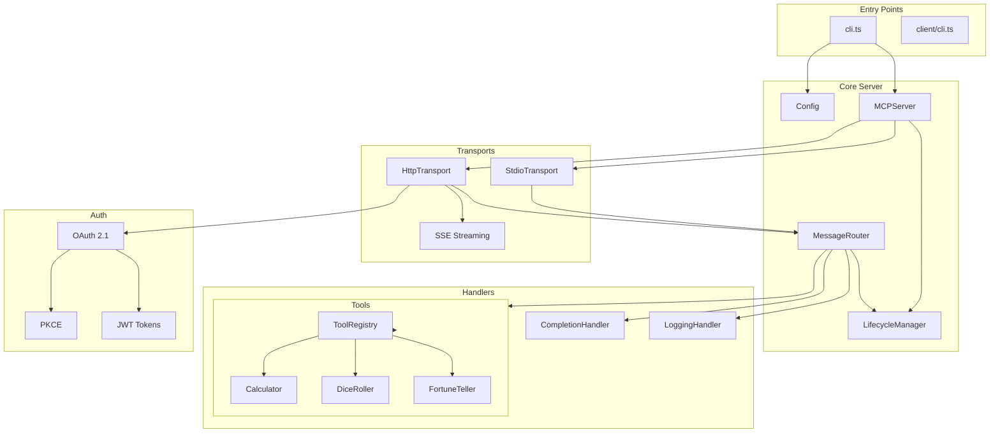
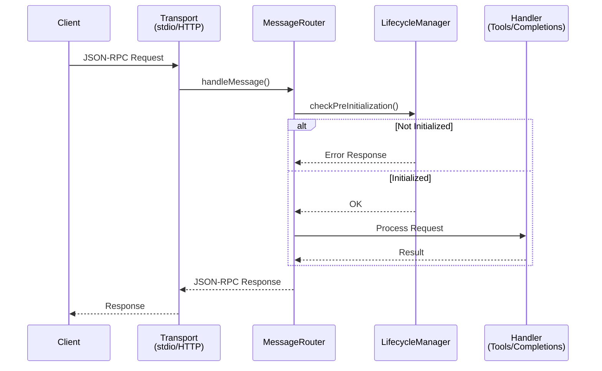
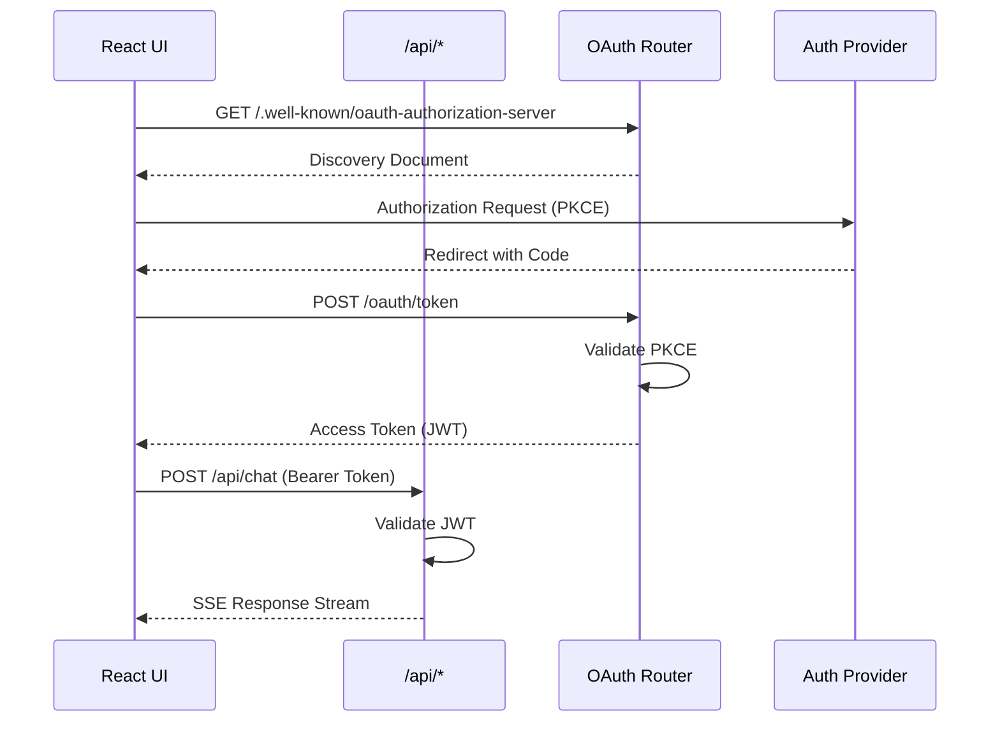

# Onboarding Report

**Generated**: 2026-01-19
**Project**: mcp-reference-server

## Project Type

- **Primary**: Node.js / TypeScript
- **Package Manager**: npm
- **Language**: TypeScript (ES2022 target, NodeNext modules)
- **Monorepo**: Yes (packages/ui is a separate React app)

## Structure

```
/
├── src/                    # Main server source
│   ├── api/               # HTTP API handlers (OAuth, chat, cancel)
│   ├── auth/              # OAuth, PKCE, tokens, scopes, discovery
│   ├── client/            # MCP client implementation + CLI
│   ├── completions/       # Auto-completion handler
│   ├── extensions/        # Extension framework, OAuth M2M
│   ├── logging/           # Logging handler
│   ├── observability/     # Telemetry, metrics, health checks
│   ├── protocol/          # JSON-RPC, lifecycle, capabilities, pagination
│   ├── tools/             # Tool registry, executor, builtin tools
│   ├── transport/         # stdio, HTTP, SSE transports
│   ├── cli.ts             # Server CLI entry point
│   ├── config.ts          # Configuration loader
│   ├── index.ts           # Public exports
│   ├── message-router.ts  # Message routing
│   └── server.ts          # Main server class + shutdown manager
├── packages/
│   └── ui/                # React + Vite + Tailwind UI
├── test/
│   ├── unit/              # Unit tests (mirrors src/ structure)
│   ├── integration/       # Integration tests
│   └── e2e/               # End-to-end tests
├── docs/
│   ├── specs/             # Feature specifications
│   ├── breakdowns/        # Chunk breakdowns
│   ├── plans/             # Implementation plans
│   └── code_review_results/
└── dist/                  # Compiled output
```

## Architecture

### High-Level Overview



### Request Flow (MCP Protocol)



### OAuth Flow (Web UI)



### Key Components

- **MCPServer**: Main server orchestrator with graceful shutdown
- **MessageRouter**: Routes JSON-RPC messages to appropriate handlers
- **LifecycleManager**: Manages server state (uninitialized → running → shutdown)
- **HttpTransport**: Express-based HTTP server with SSE support
- **StdioTransport**: stdin/stdout transport for CLI integration
- **ToolExecutor**: Executes registered tools with validation and timeout
- **ToolRegistry**: Stores and manages tool definitions

## Build & Test

| Command | Status | Notes |
|---------|--------|-------|
| Install | ✅ | node_modules present |
| Build | ✅ | tsc compiles cleanly |
| Typecheck | ✅ | No type errors |
| Unit Tests | ✅ | 2047 passed (45 test files, ~44s) |
| E2E Tests | ✅ | 91 passed (9 test files, ~83s) |
| UI Build | ✅ | Vite builds successfully |
| UI Lint | ⚠️ | 1 warning (fast-refresh export) |

**Test Requirements**:
- Must run outside sandbox (port binding requires permissions)
- E2E tests require `OPENROUTER_API_KEY` env var for agent tests

## Key Scripts

| Script | Purpose |
|--------|---------|
| `npm run build` | TypeScript compilation |
| `npm run typecheck` | Type checking without emit |
| `npm test` | Run unit tests (Vitest) |
| `npm run test:e2e` | Run E2E tests |
| `npm run start` | Start compiled server |
| `npm run dev` | Start server with tsx (dev mode) |
| `npm run client` | Run MCP client CLI |
| `npm run client:dev` | Run MCP client in dev mode |
| `npm run lint` | ESLint |
| `npm run clean` | Remove dist/ |

## CLI Commands

Two binaries are exposed:
- `mcp-reference-server` - Main server (dist/cli.js)
- `mcp-client` - Client CLI (dist/client/cli.js)

## Dependencies

### Production
- `@modelcontextprotocol/sdk` - Official MCP SDK
- `@openrouter/ai-sdk-provider` - LLM provider for agent
- `ai` - Vercel AI SDK
- `express` - HTTP server
- `jose` - JWT handling
- `commander` - CLI framework
- `zod` - Schema validation
- `chalk` - Terminal colors

### Development
- `typescript` - TypeScript compiler
- `vitest` - Test framework
- `@vitest/coverage-v8` - Coverage
- `tsx` - TypeScript execution
- `eslint` - Linting
- `@opentelemetry/*` - Observability (tracing, metrics)

## Features & Capabilities

### MCP Protocol Implementation
- JSON-RPC 2.0 message handling
- Server lifecycle (initialize, shutdown)
- Capability negotiation
- Tool registration and execution
- Completion handlers
- Progress reporting
- Pagination support

### Transports
- **stdio** - Standard input/output transport
- **HTTP** - REST/HTTP transport with sessions
- **SSE** - Server-Sent Events for streaming

### Authentication
- OAuth 2.1 with PKCE flow
- JWT token validation
- Scope-based authorization
- M2M (machine-to-machine) auth
- Well-known discovery endpoints

### Built-in Tools
- Calculator
- Dice Roller
- Fortune Teller

### Client
- MCP client implementation
- Agent with tool execution
- LLM provider integration (Anthropic, OpenRouter)

### UI Package (packages/ui)
- React 18 + TypeScript
- Vite bundler
- Tailwind CSS + Radix UI
- Markdown rendering (react-markdown)

### Observability
- OpenTelemetry integration
- Metrics collection
- Health check endpoints
- Debug logging

## Test Infrastructure

- **Framework**: Vitest 2.x
- **Coverage**: @vitest/coverage-v8 (available)
- **Tiers**: Unit / Integration / E2E
- **Config Files**:
  - `vitest.config.ts` - Unit/integration tests
  - `vitest.e2e.config.ts` - E2E tests
- **Helpers**: `test/helpers/` and `test/e2e/helpers/`
- **Environment**: `OPENROUTER_API_KEY` required for E2E agent tests

## Project Management

- Uses **beads (bd)** for issue tracking (see AGENTS.md)
- Specs in `docs/specs/`
- Chunk breakdowns in `docs/breakdowns/`

## UI Screenshots

The project includes a React-based web UI (`packages/ui`).

### Login Screen

- Centered card with "MCP Agent Chat" title
- "Sign in to start chatting with the agent" subtitle
- Single "Sign In" button (OAuth flow)

### Main Chat Interface

- Header with "MCP Agent Chat" title and "Show Tools" toggle
- Welcome message with quick-start suggestions:
  - "Get started" - What can you help me with?
  - "List tools" - What tools do you have available?
  - "Run a command" - Shell command execution
  - "File operations" - File management help
- Message input at bottom with send button

### Tools Panel

- Expandable "Available Tools" section
- Lists registered MCP tools (Calculator, DiceRoller, FortuneTeller)
- "Refresh" button to reload tool list
- Error state shown when backend unavailable

**To capture screenshots manually:**
```bash
cd packages/ui
VITE_AUTH_REQUIRED=false npm run dev
# Open http://localhost:5173 in browser
```

## Observations

- Clean TypeScript with strict mode enabled
- Well-organized modular architecture
- Comprehensive test coverage: 2047 tests across 45 files
- OAuth 2.1 implementation is substantial (~25KB in auth/)
- Extension framework for custom functionality
- Integration tests include real server lifecycle and SSE reconnection scenarios
- Agent tests verify LLM tool execution with calculator, dice roller, and fortune teller

## Next Steps

Suggested commands based on findings:
- `/test-audit` - Deep dive into test coverage gaps
- `/health` - Code quality inspection
- `npm run test:e2e` - Run E2E tests (OAuth flows, agent scenarios)
