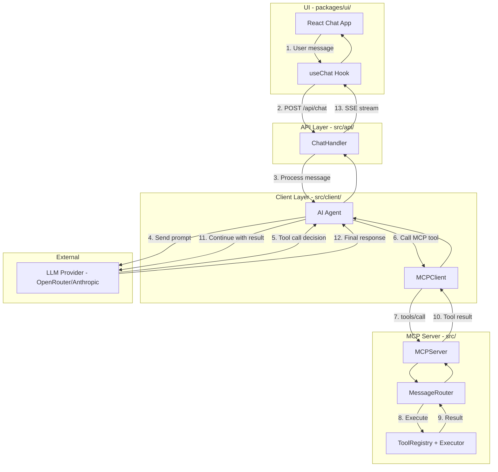
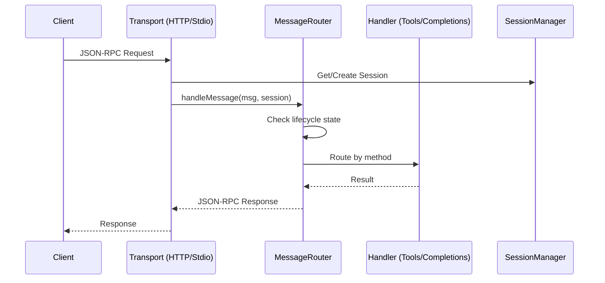

# Onboarding Report

**Generated**: 2026-01-20
**Project**: mcp-reference-server v0.1.0

## Project Type

- **Primary**: Node.js / TypeScript
- **Package Manager**: npm (package-lock.json)
- **Language**: TypeScript 5.6+ (ES2022 target)
- **Runtime**: Node.js >= 20.0.0

## Structure

```
mcp-reference-server/
├── src/                    # Main server source
│   ├── api/                # REST API handlers (chat, cancel, auth, OAuth)
│   ├── auth/               # OAuth, PKCE, tokens, M2M auth
│   ├── client/             # MCP client + AI agent
│   ├── completions/        # Auto-completion handler
│   ├── extensions/         # Extension framework
│   ├── logging/            # Log level handler
│   ├── observability/      # Telemetry, metrics, health
│   ├── protocol/           # JSON-RPC, lifecycle, errors
│   ├── tools/              # Tool registry + built-in tools
│   ├── transport/          # Stdio, HTTP, SSE transports
│   ├── cli.ts              # Server CLI entry point
│   ├── config.ts           # Configuration loader
│   ├── message-router.ts   # Central message routing
│   ├── server.ts           # MCPServer class + shutdown
│   └── index.ts            # Public exports
├── packages/
│   └── ui/                 # React chat UI (Vite + Tailwind)
├── test/
│   ├── unit/               # Unit tests (mirrors src/)
│   ├── integration/        # Integration tests
│   └── e2e/                # End-to-end tests
└── dist/                   # Built output
```

## Architecture

### High-Level Overview



### Data Flow



### Key Components

| Component | Location | Purpose |
|-----------|----------|---------|
| MCPServer | `src/server.ts` | Main server orchestrator with graceful shutdown |
| MessageRouter | `src/message-router.ts` | Routes JSON-RPC to handlers by method |
| HttpTransport | `src/transport/http.ts` | HTTP/SSE transport with session management |
| StdioTransport | `src/transport/stdio.ts` | Stdio transport for subprocess mode |
| ToolRegistry | `src/tools/registry.ts` | Tool registration and lookup |
| ToolExecutor | `src/tools/executor.ts` | Tool execution with validation |
| MCPClient | `src/client/mcp-client.ts` | Client for connecting to MCP servers |
| Agent | `src/client/agent.ts` | AI agent with tool calling via LLM |

## Build & Test

| Command | Status | Notes |
|---------|--------|-------|
| Install | ✅ | `npm install` |
| Build | ✅ | `npm run build` (tsc) |
| Typecheck | ✅ | `npm run typecheck` |
| Unit Tests | ✅ 2047 passed | `npm test` |
| E2E Tests | ✅ 91 passed | `npm run test:e2e` (requires OPENROUTER_API_KEY) |

## Key Scripts

| Script | Purpose |
|--------|---------|
| `npm run build` | Compile TypeScript to dist/ |
| `npm run dev` | Run server with tsx (development) |
| `npm run start` | Run compiled server |
| `npm test` | Run unit + integration tests |
| `npm run test:e2e` | Run E2E tests (needs API key) |
| `npm run typecheck` | Type-check without emit |
| `npm run lint` | ESLint check |
| `npm run client` | Run MCP client CLI |

## Dependencies

### Production
| Package | Purpose |
|---------|---------|
| `@modelcontextprotocol/sdk` | Official MCP SDK |
| `@openrouter/ai-sdk-provider` | OpenRouter LLM integration |
| `ai` | Vercel AI SDK for streaming |
| `express` | HTTP server framework |
| `jose` | JWT/JWS handling |
| `zod` | Runtime type validation |
| `commander` | CLI argument parsing |
| `chalk` | Terminal colors |

### Development
| Package | Purpose |
|---------|---------|
| `vitest` | Test runner |
| `typescript` | Type system |
| `tsx` | TypeScript execution |
| `@opentelemetry/*` | Observability instrumentation |
| `eslint` | Linting |

## Features & Capabilities

### MCP Protocol Methods
- `initialize` / `notifications/initialized` - Lifecycle handshake
- `tools/list` - List available tools
- `tools/call` - Execute a tool
- `completion/complete` - Argument auto-completion
- `logging/setLevel` - Set log level
- `ping` - Health check

### Built-in Tools
1. **calculate** - Basic arithmetic (add, subtract, multiply, divide)
2. **roll_dice** - Dice rolling (e.g., "2d6+5")
3. **tell_fortune** - Fortune generation by category/mood

### Transports
- **Stdio** - Subprocess communication via stdin/stdout
- **HTTP** - REST API at `/mcp` endpoint
- **SSE** - Server-sent events for streaming

### REST API Endpoints
| Endpoint | Method | Purpose |
|----------|--------|---------|
| `/api/health` | GET | Health check |
| `/api/chat` | POST | Chat with SSE streaming |
| `/api/cancel` | POST | Cancel in-progress generation |
| `/oauth/*` | Various | OAuth 2.0 flow (when enabled) |

### CLI Commands
```bash
# Server
mcp-reference-server          # Start MCP server

# Client
mcp-client chat --server "node dist/cli.js"  # Interactive chat
mcp-client tools --server "..."              # List tools
mcp-client call <tool> <args> --server "..." # Call tool directly
mcp-client info                              # Show provider info
```

## Test Infrastructure

- **Framework**: Vitest 2.0
- **Coverage**: Available via `npm run test:coverage`
- **Tiers**:
  - Unit tests: 45 test files, 2047 tests
  - E2E tests: 9 test files, 91 tests
- **E2E Requirements**: `OPENROUTER_API_KEY` environment variable

## UI (packages/ui)

React-based chat interface with:
- Vite 5.4 build system
- Tailwind CSS styling
- Radix UI components
- OAuth authentication support
- SSE streaming chat
- Tool visibility panel
- Rate limit handling

### UI Features

| Feature | Description |
|---------|-------------|
| Welcome screen | Suggestion cards for common tasks |
| Chat input | Message input with send button |
| Tools panel | Toggle "Show/Hide Tools" to view available MCP tools |
| Streaming | Real-time SSE response streaming |
| Auth | Optional OAuth login screen |

### Running the UI

```bash
# Start server (in one terminal)
OPENROUTER_API_KEY=your-key MCP_CURSOR_SECRET=$(openssl rand -base64 32) npm run start

# Start UI (in another terminal)
cd packages/ui
VITE_AUTH_REQUIRED=false npm run dev
# Open http://localhost:5173
```

## Environment Variables

| Variable | Purpose | Required |
|----------|---------|----------|
| `OPENROUTER_API_KEY` | LLM API access | For chat/E2E tests |
| `MCP_CURSOR_SECRET` | JWT signing secret | For production |
| `AUTH_ENABLED` | Enable auth middleware | Optional |
| `VITE_AUTH_REQUIRED` | UI auth requirement | Optional |
| `OAUTH_SERVER_ENABLED` | Enable OAuth routes | Optional |

## Observations

- Well-structured monorepo with clear separation of concerns
- Comprehensive test coverage (2047 unit + 91 E2E tests)
- Production-ready features: graceful shutdown, session management, CORS
- OpenTelemetry instrumentation for observability
- Stateless mode option for horizontal scaling
- Extension framework for custom functionality

## Next Steps

```bash
# Explore specific modules
/retro-spec src/transport/http.ts    # Document HTTP transport

# Analyze test coverage gaps
/test-audit                          # Deep dive into coverage

# Code quality inspection
/health                              # Code health scan

# Plan new features
/spec "Add custom tool support"      # Design new capability
```
